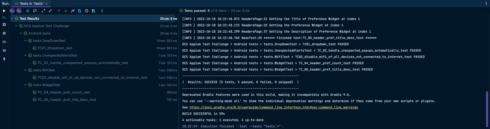

# Appium DCS Assignment

* This project is a solution for the DCS Test Study assignment and automates important scenarios for the automation.
* This is by no-means a full-fledged automation framework, rather a solution to a challenge task.

## Pre-requisites

This project is built and tested with the following dependencies:

* JAVA JDK 17.0.2
* Gradle 8.2.1
* Node 18.16.0
* Appium Server 2.0.1 or higher
* Appium UiAutomator2 driver 2.29.4 or higher
* Android Studio
    * Android_HOME SDK, platform-tools and cmdline-tools set in environment variables
    * Check if ADB is globally installed with `adb --version`
    * Android Emulator
        * For example, Pixel 5 with Android 13.0 Google Play | x86_64
* GIT Bash

## Libraries

* [Java 17](https://openjdk.org/projects/jdk/17/) as programming language
* [Appium Java Client 9.0.0](https://mvnrepository.com/artifact/io.appium/java-client/8.6.0) as native app automation library
* [TestNG](https://mvnrepository.com/artifact/org.testng/testng/7.8.0) as testing framework to support the test creation and hooks
* [AssertJ](https://assertj.github.io/doc/) as the fluent assertion library
* [Log4j2](https://logging.apache.org/log4j/2.x/) as the logging management strategy
* [Owner](https://github.com/matteobaccan/owner) to minimize the code to handle properties files

## Installation

* Check the following resources on how to setup Appium 2.0:
  * [Machine setup for Appium 2.0: Mastering Appium 2.0](https://www.youtube.com/watch?v=wT2iiAUQ5BA)
  * [Beginner’s Guide to Appium 2.0](https://medium.com/@iamfaisalkhatri/beginners-guide-to-appium-2-0-d8118b31837c)

> Use [appium doctor](https://github.com/appium/appium/tree/master/packages/doctor) to check if your system has been successfully setup with appium

> Run the command appium-doctor to verify the setup (Xcode is not required for this task)


## Application Under Test

[android-apidemos](https://github.com/appium/android-apidemos)

A fork of Google's Android ApiDemos application, used for testing Appium

## Test Cases

There are a total of 05 test cases implemented.

### TestCase 01: Scroll to element, and select value from dropdown

* Click on "Views" Tab
* Scroll down to the "Spinner" tab (which is not initially visible on-screen) and click
* Select blue color from the dropdown list
* Verify that the blue color is selected in dropdown

### TestCase 02: Handle unexpected popup automatically

* Click on "App"
* Click on "Alert Dialogs"
* Assuming we have this dialog that can appear automatically on alerts screen:
  * Simulate the appearance of this popup by:
    * Click on "OK Cancel dialog with a message"
* Click on "List dialog"
* Validate the appearance of this dialog
  * This command will only be successfully is the popup alert displayed in previous step is handled automatically

### TestCase 03: Find all connected Device UDIDs and Disable WiFi of device not connected to Internet

* This test case uses ADB Shell commands to execute the task
* It first finds out all the connected devices UDIDs
* It then filters out the devices that are not connected to internet over Wi-Fi
* For each of the filtered device:
  * It switches off the Wi-Fi
  * And validates that Wi-Fi is disabled

### TestCase 04-05 (Bonus/Optional): Appium Widget Implementation

> This test case validates the list of elements on Headers Screen as Widgets
* 
* Click on "Preference"
* Click on "08. Headers"
* Validate the Preference Total Count
* Validate the second Preference's title and description

## Running Tests

* Create the Android Emulator and start it from Android Studio.
    * You can get the UDID of emulator with the following adb command `adb devices`
* Clone the repo
* Open the project `build.gradle` in IDE of your choice and install the project dependencies.
    * IntelliJ IDEA is recommended.
* Configure the following according to your system setup:
    * appium server host and port inside `src/test/resources/server.properties`
    * android UDID of the emulator inside `src/test/resources/android.properties`
* For the WiFi test, attach a real android device to your phone with developer mode enabled, and USB Debugging mode also enabled.
  * Setup this phone such that WiFi is switched on but not connected to any SSID
  * TC_03 will scan all the connected devices and switch off the WiFi for device that is not connected to internet
* Start the Appium server with uiautomator2 driver for android via terminal:
```shell
appium --use-drivers=uiautomator2
```

> To keep things simple, we are not starting appium server programmatically

* Use IDE Terminal or navigate to the project root directory and run following command in terminal:
```shell
gradle clean test
```
* You can also run the tests from IDE by right-clicking the test package and selecting "Run Tests in 'tests'"

* Gradle terminal output for the project looks like below:



* It will run the whole regression suite comprising of 5 test cases split between 4 test classes.
* Results will be available in terminal after the build is finished.
* TestNG HTML report is generated and available at `test-output/index.html`
* Gradle HTML report is generated and available at `gradle-reports/index.html`

* Gradle terminal output for the project looks like below: 


